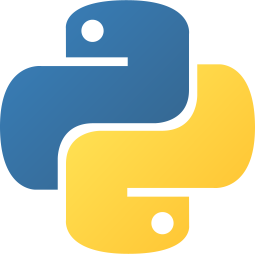
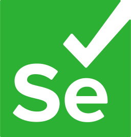
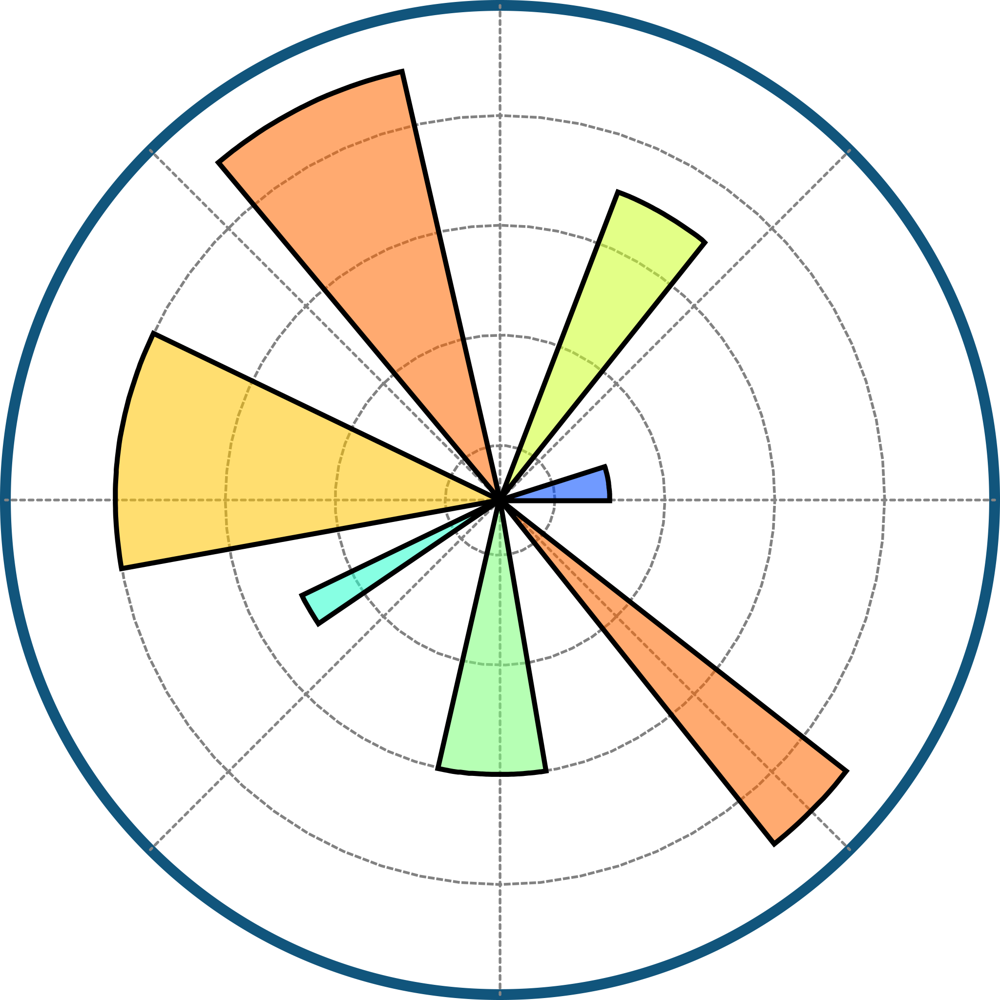

<h1 align="center">Hi 👋🏻, I'm Adam</h1>
<h3 align="center">IT admin & Junior SW Developer</h3>

  

- 🔭 ***I’m currently working on:*** Building out my Portfolio
 
- 🌱 ***I’m currently learning:*** IT Administration, Web Development, Python, Machine Learning

- 👨‍💻 ***All of my projects are available at:*** **[adambudac.sk](https://adambudac.sk/)**

- 📫 ***How to reach me:*** **info@adambudac.sk**

- ⚡ ***My hobbies are:***  IT, Electronics, Photography, Music, Driving, Traveling, Workout, Cycling, Swimming, Badminton, Hiking, Volleyball, Skiing

<h2 align="center">Connect with me:</h2>

    
    

<h2 align="center">Languages and Tools:</h3>
<h3 align="center">Web Development:</h3>

    
    
    
    
    
    
     
     
     
    <!--
     
    
     
    -->

<h3 align="center">Apps and Machine Learning:</h3>

    
    
    
    
    
    
    
    
    
    
    
    
    
    <!--
    
    
    
    
    
    
    
    
    
    -->

<h3 align="center">Tools:</h3>

    
    
    
    
    
    
    
    
    
    
    
    
    
    
    
    
    
    
    
    

<h3 align="center">Software:</h3>

    
    
    
    
    
    
    
    
    

 

<!-- Created with https://rahuldkjain.github.io/gh-profile-readme-generator/ -->
<!-- Created with https://github.com/devicons/devicon/tree/master -->
<!-- Created with https://github.com/get-icon/geticon -->
<!-- Created with https://github.com/walkxcode/dashboard-icons -->
<!-- Created with https://www.vectorlogo.zone/ -->
<!-- Created with https://logosear.ch/search.html -->
<!-- Created with https://worldvectorlogo.com/ -->
<!-- Created with https://www.svgrepo.com/ -->
